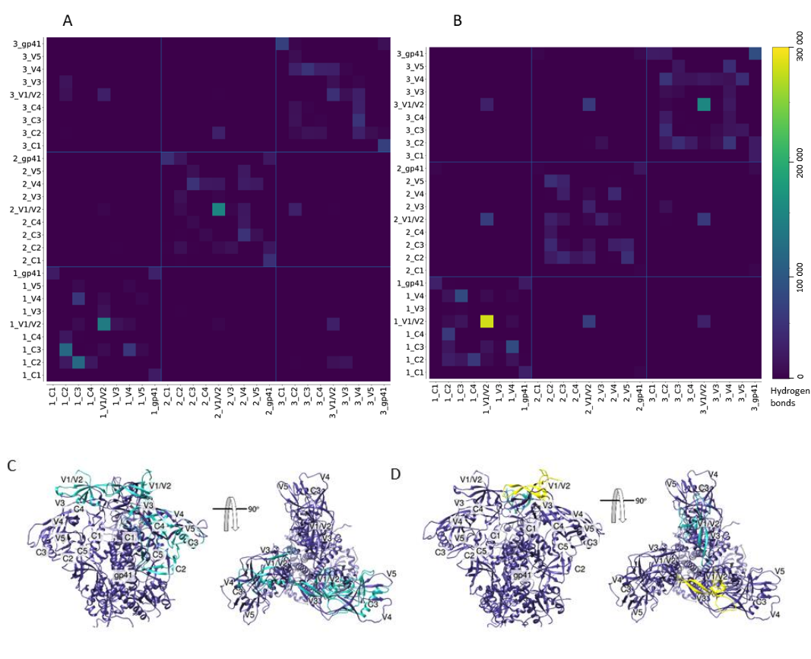
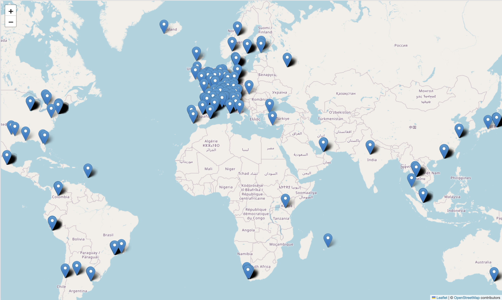
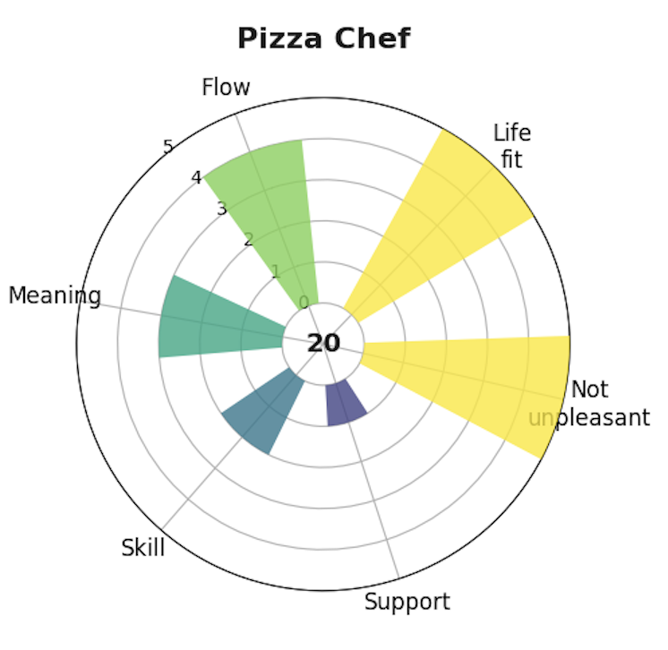

## Featured Visualisations

### HIV Envelope: Hydrogen bonding heatmap and structure
For my Masters, I worked on HIV structure, and how different parts of the protein interacted.  
Yellow = strong interactions, purple = low or no interaction. 

### Dynamic Map of World's Best Restaurants from 2002-2023
This is a screenshot of a dynamic map of the World's Best Restaurants (at least by someone's measure!)

Dataset from [Kaggle](https://www.kaggle.com/datasets/thomasfranois/worlds-best-restaurants/data), originally sourced from [The World's 50 Best Restaurants](https://www.theworlds50best.com/).

### Compass plot based on 80,000 Hours factors for a fulfilling career
See the [80,000 Hours article](https://80000hours.org/career-guide/job-satisfaction/). 

I enjoy making pizza, but I'm not sure it's right as a career direction for me! 

<!--
**ClareGarrard/ClareGarrard** is a ✨ _special_ ✨ repository because its `README.md` (this file) appears on your GitHub profile.

Here are some ideas to get you started:

- 🔭 I’m currently working on ...
- 🌱 I’m currently learning ...
- 👯 I’m looking to collaborate on ...
- 🤔 I’m looking for help with ...
- 💬 Ask me about ...
- 📫 How to reach me: ...
- 😄 Pronouns: ...
- ⚡ Fun fact: ...
-->
